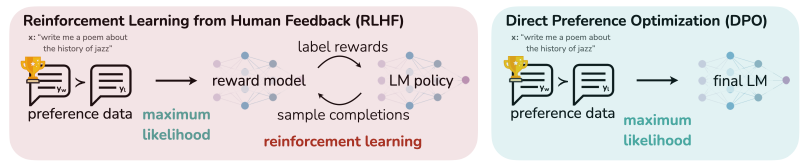

# Direct Preference Optimization (DPO): Your Language Model is Secretly a Reward Model
### Simplifying Human Alignment Without Reinforcement Learning

**Paper:** [Direct Preference Optimization: Your Language Model is Secretly a Reward Model](https://arxiv.org/abs/2305.18290)  
**Authors:** Rafael Rafailov*, Archit Sharma*, Eric Mitchell*, Stefano Ermon, Christopher D. Manning, Chelsea Finn (*equal contribution)  
**Organization:** Stanford University & CZ Biohub  
**Published:** July 2023 (NeurIPS 2023)  
**ArXiv:** [2305.18290](https://arxiv.org/abs/2305.18290)  

**Presented by:** Ke Xu  
**Date:** November 2025  

---

*Figure 1. Comparison between RLHF (left) and DPO (right). DPO eliminates the reward model and RL loop, using a single training pass with preference pairs.*

## 1. Context and Motivation

**Reinforcement Learning from Human Feedback (RLHF)** — used by models like InstructGPT and ChatGPT — aligns LLMs to human preferences, but at a cost:
- **Complexity:** multiple models (policy + reward)
- **Instability:** RL training via PPO often diverges
- **Computation:** expensive sampling loops


### Problem Statement
**Direct Preference Optimization (DPO)** asks a radical question:  
> Can we achieve the same alignment quality as RLHF — *without* reinforcement learning or a separate reward model?


<details>
<summary>Click to reveal answer</summary>

The answer: **Yes.**  
DPO reframes RLHF as a *direct supervised optimization problem* using preference pairs.

</details>


---

## 2. The Problem

Traditional RLHF uses this optimization:

$$
\max_\pi \mathbb{E}_{y \sim \pi}[r(x,y)] - \beta D_{KL}(\pi \| \pi_{\text{ref}})$$

This equation means that the model (policy π) tries to find a balance between **two opposing forces**:

where:
- **Reward term:** $\mathbb{E}_{y\sim\pi}[r(x,y)]$ — encourage outputs that humans like. The higher the reward $r(x,y)$, the more likely the model is to produce that response.
- **Regularization term:** $D_{KL}(\pi \| \pi_{\text{ref}})$ — penalize outputs that deviate too much from the reference model $\pi_{ref}$, ensuring stability
- **β (beta):** controls the tradeoff. A small β means more creative drift (less penalty); a large β means conservative adherence to the reference model.

In simple terms: RLHF trains the model to “be liked by humans, but not forget who it used to be.” It’s a tug-of-war between maximizing human approval and maintaining prior knowledge.

While effective, it requires:
1. Defining Supervised Fine Tuning (SFT) (correct structured behavior from x to y)
2. Training a **reward model** from human preference data  
3. Running **policy optimization** (e.g., PPO)  
4. Careful tuning of the KL penalty to avoid *reward hacking* (over optimizing specific patterns)


> **DPO’s goal:** eliminate last three steps, yet preserve equivalent preference learning.

---

## 3. The Core Idea

### Q1: What makes DPO conceptually different from RLHF?

Start with RLHF’s optimal policy:

$$
\pi^*(y|x) \propto \pi_{\text{ref}}(y|x) \exp\left(\frac{r(x,y)}{\beta}\right)
$$

Which says:
> the probability that the model gives a certain answer y depends on two things: how likely that answer was before fine-tuning (the reference model), and how much reward humans give to that answer.

After rearranging the equation to this:

$$
r(x,y) = \beta \log \frac{\pi^*(y|x)}{\pi_{\text{ref}}(y|x)} + C
$$

This equation reveals something profound:
> The reward function can be expressed **entirely** in terms of the model’s log probabilities.

> In other words, we can measure preference directly by comparing how likely the model is to choose one answer versus another.

So instead of training an explicit reward model with numeric values assigned to a subset of responses, we can increase the log-probability of preferred responses or change the gradients relative to the reference model during the model training stage.


## 4. DPO Objective Derivation

> Now that we know reward can be replaced by log probabilities, we can design a new way to teach the model. We can comparing pairs of responses for the same question instead of ranking with numerical values.

$(x, y_w, y_l)$ — where $y_w$ is the preferred response, $y_l$ is the less preferred one.

The Bradley–Terry model gives the probability of preferring $y_w$ over $y_l$:

$$
P(y_w \succ y_l | x) = \sigma\left(\beta\left[
\log\frac{\pi(y_w|x)}{\pi_{\text{ref}}(y_w|x)} -
\log\frac{\pi(y_l|x)}{\pi_{\text{ref}}(y_l|x)}\right]\right)
$$

> Intepretation: take the difference in confidence between the two answers,
compare it to what the old reference model believed,
and then feed that into a sigmoid — a simple squashing function that converts any number into a probability between 0 and 1.”

This leads to the **Direct Preference Optimization loss**:

$$
L_{\text{DPO}} = - \log P(y_w \succ y_l | x)
$$

> Intepretation: The more it disagrees with human preferences, the higher the loss, 
and gradient descent nudges it in the right direction


✅ **No reward model**  
✅ **No PPO or sampling**  
✅ **Single supervised objective**

### Quick example:
Both PPO (used in RLHF) and DPO (used in preference optimization) are like training a smart dog — but the **training styles** differ.


<details>
<summary>Click Me 🐶🐕🐶🦮🐶</summary>

--- 
PPO training is like **teaching a dog through trial and error with treats**.

- You **show the dog** what to do (SFT).
- You then **score** its behaviors using a reward model ("Good boy!" or "Nope!").
- The dog **tries many times**, gradually learning which actions yield more treats.
- You must **penalize overexcited behaviors** (the KL penalty) to stop it from gaming the system

DPO is like **showing the dog two tricks and simply saying which one you prefer**.

- No treat scoring system, no guesswork.
- You say: “Between these two sits, I like this one better.”
- The dog updates directly based on your comparison — it doesn’t need to estimate the entire reward landscape.

---
</details>


## 5. Algorithm Overview

### **Algorithm 1: Direct Preference Optimization**

```python
# Direct Preference Optimization (DPO)
# Inputs: preference dataset D = {(x, y_w, y_l)},
#         reference model π_ref,
#         temperature β

for (x, y_w, y_l) in D:
    # Compute scaled log-prob differences
    Δπ = log πθ(y_w|x) - log πθ(y_l|x)
    Δref = log π_ref(y_w|x) - log π_ref(y_l|x)

    # Compute preference probability
    p = sigmoid(β * (Δπ - Δref))

    # Cross-entropy loss: encourage preferred response
    loss = -log(p)

    # Gradient update
    θ ← θ - η ∇θ(loss)
```
---


### **1. for (x, y_w, y_l) in D:**
- Iterate through the **dataset of human preferences** `D`.
- Each data point includes:
  - **x** – the input or prompt  
  - **y_w** – the *preferred* (winner) output chosen by a human  
  - **y_l** – the *less preferred* (loser) output  

**Purpose:**  
Go through all human-rated preference pairs to update the model toward human-preferred behavior.

---

### **2. Δπ = log πθ(y_w|x) - log πθ(y_l|x)**
- $\pi_\theta(y|x)$: the **trainable model** (policy).  
  It gives the probability that the current model generates response $y$ for prompt $x$.
- $\log \pi_\theta(y|x)$: log-probability of that output.

**Δπ** = how much more likely your current model $ \pi_\theta $ thinks the preferred answer $ y_w $ is compared to the rejected one $ y_l $.

$$
\Delta_\pi = \log \pi_\theta(y_w|x) - \log \pi_\theta(y_l|x)
$$

**Interpretation:**  
- If `Δπ > 0`, the model already agrees with the human preference.  
- If `Δπ < 0`, the model disagrees — it needs correction.

---

### **3. Δref = log π_ref(y_w|x) - log π_ref(y_l|x)**
- $\pi_{\text{ref}}(y|x)$: the **reference model** (frozen baseline, e.g., SFT or base LM).  
- This computes how *the old model* valued the same two responses.

$$\Delta_{\text{ref}} = \log \pi_{\text{ref}}(y_w|x) - \log \pi_{\text{ref}}(y_l|x)$$

**Interpretation:**  
This serves as a **stability anchor**.  
It tells us how far our fine-tuned model’s preference differs from the reference model’s original preference.

---

### **4. p = sigmoid(β * (Δπ - Δref))**
Applies the **Bradley–Terry preference model** to convert differences into a probability that the model prefers $ y_w $ over $ y_l $:

$$p = \sigma(\beta[(\Delta_\pi - \Delta_{\text{ref}})])$$
where:
- $\sigma(z) = \frac{1}{1 + e^{-z}}$
- $\beta$ is a temperature coefficient controlling update strength.

**Interpretation:**  
- $p ≈ 1$: model confidently agrees with humans.  
- $p ≈ 0.5$: model is uncertain.  
- $p < 0.5$: model prefers the wrong (human-disliked) response.

This step turns the **log-prob difference** into a normalized “preference probability.”

---

### **5. loss = -log(p)**
This is the **binary cross-entropy loss** for a correct (preferred) label:

$$
L = -\log(p)
$$

**Interpretation:**  
- The loss is small if $p$ is close to 1 (the model’s preference matches humans).  
- The loss is large if $p$ is small (the model disagrees).

**Goal:**  
Encourage the model to assign higher probability to human-approved completions and lower probability to rejected ones.

---

### **6. θ ← θ - η ∇θ(loss)**
The standard **gradient descent update** step:

$$
\theta \leftarrow \theta - \eta \nabla_\theta(L)
$$

- $\theta$: model parameters  
- $\eta$: learning rate  
- $\nabla_\theta(L)$: gradient of the loss with respect to parameters

**Interpretation:**  
The model updates its weights to **increase** $\pi_\theta(y_w|x)$ relative to $\pi_\theta(y_l|x)$, effectively **learning to rank human-preferred answers higher**.

**Interpretation:**  
- Increase log-prob of human-preferred outputs  
- Decrease log-prob of rejected ones  
- Regularized by the reference model to prevent drift

---

## 6. Architecture Comparison

| Aspect | RLHF | DPO |
|--------|-------|-----|
| **Learning Signal** | Reward model + PPO loop | Direct supervised loss |
| **Required Models** | Policy, Reward, Value | Single policy + frozen ref |
| **Stability** | Sensitive to reward scaling | Stable by design |
| **Compute Cost** | High (sampling + RL) | Low (one-pass fine-tuning) |
| **Interpretability** | External reward function | Implicit reward via logits |
| **Key Hyperparameter** | KL penalty + PPO clip | β (temperature) |


## 7. Experimental Findings

**Datasets:**  
- IMDb (Sentiment Control)  
- Reddit TL;DR (Summarization)  
- Anthropic HH (Helpful–Harmless Dialogue)

**Metrics:**  
- Reward per KL (alignment efficiency)  
- Win rate (human preference %)  
- Stability and generalization

| Task | Baseline | DPO Result |
|------|-----------|------------|
| IMDb Sentiment | PPO | **+9% Reward/KL Efficiency** |
| Reddit TL;DR | PPO | **61% Human Win Rate** (vs 57%) |
| Anthropic HH | PPO | **Only DPO improved over human reference** |
| Out-of-Distribution (CNN/DailyMail) | PPO | **Higher Generalization** |
| Compute Efficiency | — | **≈10× Faster** (no RL loop) |

**Conclusion:**  
DPO matches or outperforms RLHF in every benchmark, with **simpler training and greater stability**.


## 8. Question: What's the preformance difference between DPO and PPO?

| Aspect              | **DPO**                                                                          | **RLHF (PPO)**                                                                      |
| :------------------ | :------------------------------------------------------------------------------- | :---------------------------------------------------------------------------------- |
| **Main operations** | Teacher-forced forward passes on preference pairs (no sampling, no reward model) | Sampling rollouts, scoring with reward model, PPO optimization                      |
| **Time per update** | **O(B · L)** — 4 forward passes (policy + ref × win/loss)                        | **O(B · L · E · T)** — sequential generation + reward scoring + multiple PPO epochs |
| **Memory**          | Policy + reference only                                                          | Policy + reference + reward + value models                                          |
| **Parallelization** | Fully parallel (teacher-forced)                                                  | Limited (rollouts are sequential)                                                   |
| **Practical cost**  | ~2–4× SFT training                                                               | ~10× – 20× SFT training                                                             |
| **Bottleneck**      | GPU throughput                                                                   | Sampling latency and extra models                                                   |


- DPO behaves like supervised fine-tuning — just a few extra forward passes to compare preferred vs. rejected answers.

- RLHF (PPO) adds reinforcement learning loops: generate, score, update repeatedly → far more compute and memory.

- So asymptotically both depend on batch size (B) and sequence length (L),
but PPO multiplies those by rollout count (T) and PPO epochs (E).

## 9. Critical Analysis

### **Strengths**

- **Simplicity & Stability:**  
  Removes RL components (reward model, PPO) and yields deterministic gradients.

- **Efficiency:**  
  Reduces RLHF’s multi-model, multi-loop process to supervised fine-tuning ~10× faster in practice.

- **Empirical Success:**  
  Matches or exceeds PPO-aligned models on standard benchmarks (HH, IMDB, TL;DR) with far less compute.

- **Reproducibility:**  
  Implementation is straightforward and reproducible across open-source settings.

### **Latency**
#### a. Reward Interpretability
While DPO demonstrates that rewards can be represented as log-probability ratios, the paper does **not deeply analyze what these implicit “rewards” mean semantically**.  
It would have been valuable to connect DPO’s implicit reward function to **human-interpretable dimensions** such as helpfulness, harmlessness, or truthfulness.  
Without that, it remains a mathematical substitution rather than an interpretable behavioral model.

#### b. Assumption of the Bradley–Terry Model
DPO assumes that human preference data follows a **Bradley–Terry logistic model** — that is, humans always rank outputs with a consistent probabilistic ordering.  
In real datasets, **human preferences are often inconsistent or context-dependent**. The paper doesn’t examine how DPO performs when the assumption breaks down.  
Recent work (e.g., *SimPO, 2025*) attempts to improve this by introducing confidence-weighted or soft preference objectives.

### **Potential Errors and oversights**
- limited evidence that DPO generalizes equally well to multilingual or multimodal setting
- The paper underemphasized how DPO’s performance depends strongly on **the diversity and cleanliness of preference pairs**

### **Reception & Discussion**

DPO sparked a new wave of “post-RLHF” methods (ORPO, IPO, SimPO), while some argue DPO is still *implicit RL*, since its objective encodes an equivalent reward signal.  
- **IPO (Implicit Preference Optimization)** – adjusts loss scaling.  
- **ORPO (Offline Regularized Preference Optimization)** – removes reference model.  
- **SimPO (Simple Preference Optimization)** – merges SFT and DPO training.


## 10. Impacts

The DPO paper fundamentally reshape AI alignment by showing that preference learning can be achieved without reinforcement learning. By reframing RLHF’s reward optimization as a simple, closed-form supervised objective based on log-probability ratios as a loss function, DPO made alignment faster, cheaper, and more stable. This breakthrough democratized alignment research, enabling smaller labs and open-source communities to train high-quality chat models (**Llama 2–Chat, Zephyr, and StableLM-Tuned**) without complex RL infrastructure. Its influence extends across modern methods such as ORPO, SimPO, and IPO, establishing DPO as a cornerstone for efficient, preference-based model training that continues to guide the future of scalable, interpretable AI alignment. 


## 11. Theoretical Insights

- **Equivalence Proof:**  
  Every optimal RLHF policy under the Bradley–Terry model corresponds to some DPO-trained policy.  
  ⇒ DPO preserves the same solution space as RLHF.

- **Implicit Reward Learning:**  
  The LM’s logits encode the reward — the model *is* its own reward function.

- **No High-Variance Gradients:**  
  By avoiding sampling-based PPO, DPO eliminates variance from stochastic rewards.

- **Interpretability:**  
  Logit differences directly measure preference satisfaction.


---

## 12. Citation

```bibtex
@article{rafailov2023direct,
  title={Direct Preference Optimization: Your Language Model is Secretly a Reward Model},
  author={Rafailov, Rafael and Sharma, Archit and Mitchell, Eric and Ermon, Stefano and
          Manning, Christopher D. and Finn, Chelsea},
  journal={arXiv preprint arXiv:2305.18290},
  year={2023}
}
```

---


---

## 13. Related Links
- Training language models to follow instructions with human feedback (Ouyang et al., 2022 – InstructGPT / RLHF Foundation):https://arxiv.org/abs/2203.02155 
- Constitutional AI: Harmlessness from AI Feedback (Bai et al., 2022 – AI-generated feedback):https://arxiv.org/abs/2212.08073
- RLAIF: Scaling Reinforcement Learning from Human Feedback with AI Feedback (Lee et al., 2023 – Reinforcement Learning from AI Feedback): https://arxiv.org/abs/2309.00267
- SimPO: Simple Preference Optimization with a Reference‑Free Reward (Meng et al., 2024 – Simplified Preference Optimization): https://arxiv.org/abs/2405.14734
- Llama 2–Chat: https://huggingface.co/meta-llama/Llama-2-7b-chat-hf
- Zephyr: https://huggingface.co/HuggingFaceH4/zephyr-7b-beta


---

## 14. Summary: Why DPO Matters

DPO proves that:
> **You can align models directly with human preferences—no reinforcement learning required.**

### Key Advantages
- One model, one objective  
- Eliminates reward model & RL instability  
- Theoretically equivalent to RLHF  
- Computationally efficient (single pass)  
- Naturally interpretable

**In short:**  
DPO turns reinforcement learning from human feedback into *supervised learning from human preference.*

---

### Key Takeaways

| Dimension | RLHF | DPO |
|------------|-------|-----|
| Training Framework | PPO + Reward Model | Single-step supervised |
| Core Concept | “Train a judge, then optimize” | “Directly optimize using preferences” |
| Compute Load | High | Minimal |
| Stability | Unstable (PPO tuning) | Stable (BCE loss) |
| Industry Trend | Proprietary, heavy infra | Open, lightweight, reproducible |


